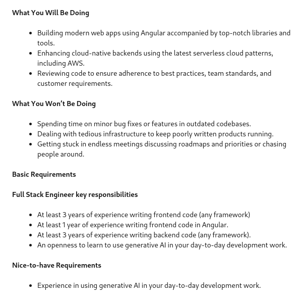

### [Full Stack Engineer, gt.school](https://www.linkedin.com/jobs/view/3812802210)

Crossover  · Vancouver, BC

#### Interest Reasons

- I think the pay is fair, and is above the minimum pay(80k) I want to work for and the position is in Vancouver as I do not want to relocate.

- Transparent interview process.

- Chance to work with AI and a modern web stack.

#### Areas to improve

- Polish up my Angular skills.
- Learn about the latest serverless cloud platforms.

